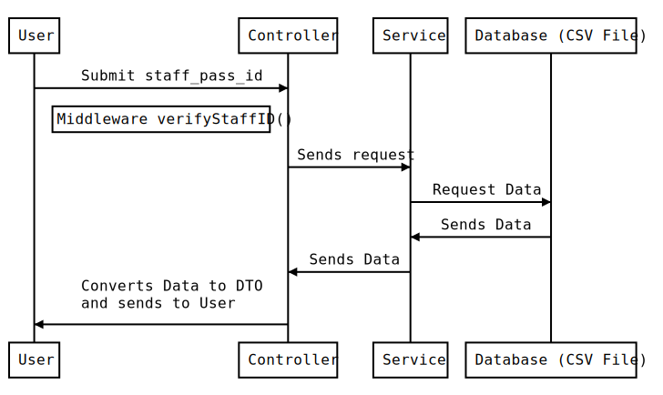
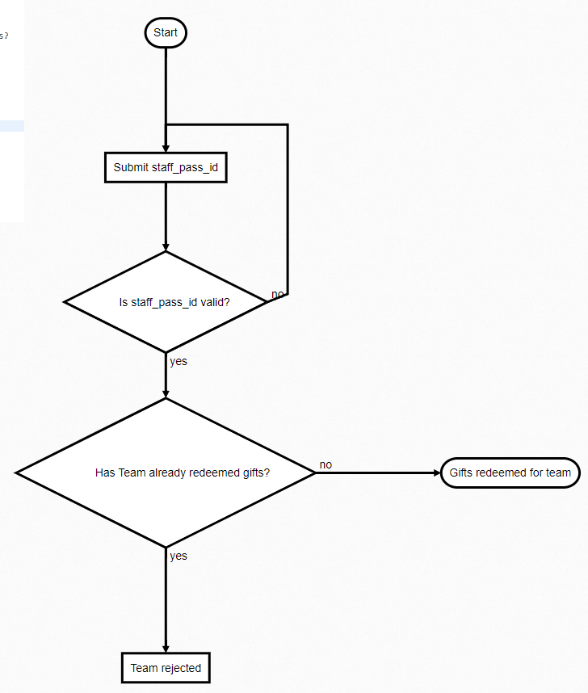

# Tabriz Pahlavi Take-Home Assignment

#### Welcome to my README for the take home assignment! In this README, I will be going through the program architecture as well as assumptions made

### Tech Stack
#### This project uses ReactJS and ExpressJS for the frontend and backend respectively, with TypeScript

### Architecture
#### The design of this project is modelled after the Model-View-Controller(MVC) framework

<ul>
<li>The View is represented by our web application which the User interacts with. Through the User interactions, Users can make requests to the controller</li>
<li>The Controller is responsible for receiving requests from the User and validating the requests. After validating the requests, the request is sent to the Model</li>
<li>The Model is responsible for processing the request. In the context of this project, the Model is responsible for retrieving data from the database (CSV file)</li>
</ul>

### Server API

#### APIs in this project are RESTful APIs. Currently, there is only one API for this project

<ul>
<li>GET - /staff/:staff_pass_id (Gets mapping for the staff with staff ID = staff_pass_id)</li>
</ul>

### Assumptions
#### 1. All valid staff_pass_id follow the format "TEXT_TEXT"
#### 2. staff_pass_id is case-sensitive
### Additional Implementation Details
#### 1. Schema of Employee: {
#### staff_pass_id: string
#### team_name: string
#### }

#### Schema of Redemption: {

#### owner: Employee
#### redeemed_at: string
#### }
#### 2. List of all redemptions are stored in a state

### Sequence Diagram

### FlowChart

### Usage
#### Frontend root folder: "TABRIZ_PAHLAVI/frontend"
#### Backend root folder: "TABRIZ_PAHLAVI/backend"
#### Before using, run `npm i` in both frontend and backend root folders
#### 1. Run `npm run start` in frontend root folder to start frontend server
#### 2. Run `npm run start` in backend root folder to start backend server
### End
